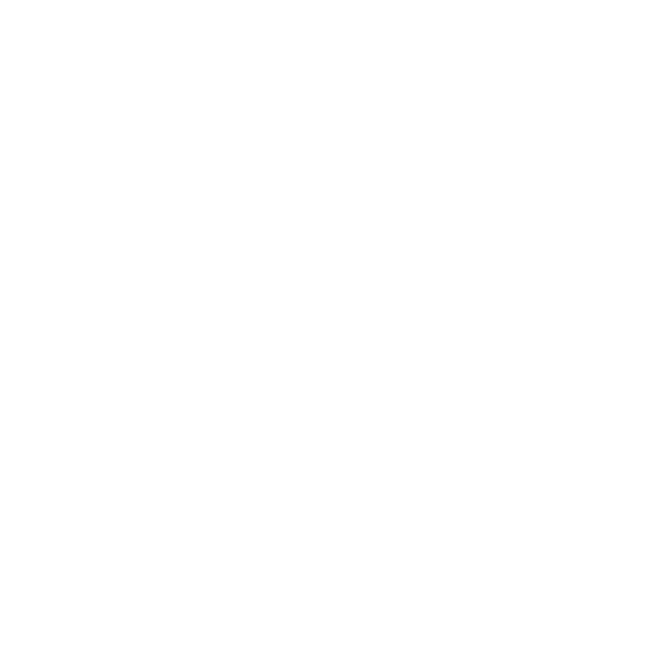

main:<br>
[](https://coveralls.io/github/den41apple/otus_architecture_and_design_patterns?branch=main)
<br>
homework_1: <br>
[](https://coveralls.io/github/den41apple/otus_architecture_and_design_patterns?branch=homework_1)
<br>
homework_2: <br>
[](https://coveralls.io/github/den41apple/otus_architecture_and_design_patterns?branch=homework_2)
<br>
homework_2: <br>
[](https://coveralls.io/github/den41apple/otus_architecture_and_design_patterns?branch=homework_3)

### Установка Зависимостей:
```shell
make install_dependencies
```